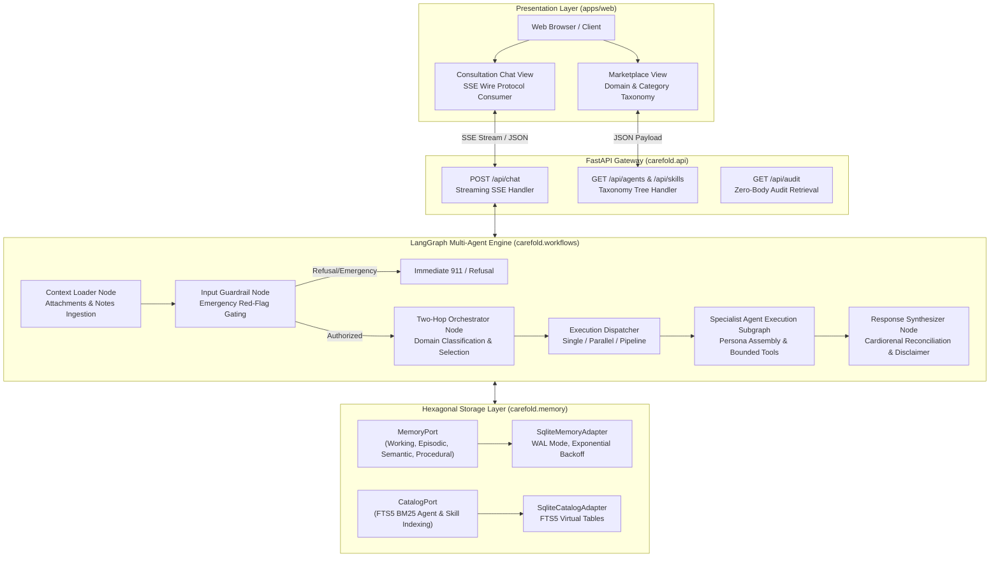

# Architecture Overview

Carefold is engineered as a production-grade healthcare AI agent marketplace and local-first execution runtime. It balances high clinical empathy and domain specialization with deterministic safety boundaries and patient-controlled privacy.

---

## Monorepo Layout

The repository is structured as a unified monorepo:

```
carefold/
├── backend/                  # Python FastAPI service & LangGraph multi-agent runtime
│   ├── src/carefold/         # Core engine implementation
│   │   ├── api/              # REST endpoints (health, chat, agents, skills, audit, models)
│   │   ├── memory/           # Hexagonal MemoryPort & CatalogPort + SQLite FTS5 adapters
│   │   ├── workflows/        # LangGraph nodes, state machine, and multi-topology dispatcher
│   │   ├── safety/           # Emergency red-flag detection & non-clinical refusal classifier
│   │   ├── loaders/          # Context loader & resource parsing
│   │   └── schemas/          # Pydantic models for manifests, state, and API schemas
│   └── tests/                # 3,900+ test suite and 47-point security penetration suite
├── apps/web/                 # Next.js 16 healthcare marketplace and chat UI (Tailwind CSS)
├── agents/                   # 20 specialist agent manifests, 6 system agents (_system/), and a starter template
├── skills/                   # 22 clinical and administrative skill packs, plus a starter template
├── packages/cli/             # Scaffolding and developer CLI
├── packages/runner/          # Sandboxed local execution runner
├── docs/                     # Verified MkDocs Material documentation and ADR repository
└── .github/                  # CI/CD workflows, CodeQL security, and issue templates
```

---

## System Component Topology

The diagram below illustrates how requests flow through Carefold's layers:



---

## Key Architectural Principles

### 1. Persona Purity
Agent definitions in Carefold strictly maintain separation of concerns:
- **`persona.md`**: Pure healthcare specialization—clinical focus, communication style, interview protocols, red flags. No filesystem paths, tool call syntax, or document filenames.
- **`agent.yaml`**: Manifest metadata—domain, category, care stages, risk class, declared skills, permitted tools.
- **`SKILL.md` & `references/`**: Modular healthcare protocols, questionnaires, and logging forms.
- **`OrchestratorNode`**: Central intelligence responsible for routing, reference document resolution, dynamic provisioning, and execution topology planning.

### 2. Hexagonal Ports and Adapters
All persistence and discovery operations interact exclusively with abstract port interfaces:
- `MemoryPort` mediates access to 4 cognitive memory tiers (`WORKING`, `EPISODIC`, `SEMANTIC`, `PROCEDURAL`).
- `CatalogPort` mediates agent and skill indexing and category hierarchy generation.
- The default adapter is `SqliteMemoryAdapter` and `SqliteCatalogAdapter` using SQLite FTS5. This architecture is designed so additional memory backends (such as the planned Spector MCP adapter) can be added without altering core workflow nodes.

### 3. Execution Topologies
The orchestrator plans execution dynamically based on patient presentation complexity:
- **`Single`**: Standard fast-path execution of a single specialist.
- **`Parallel`**: Multimorbid presentations (e.g., patient presenting with overlapping symptoms across cardiology and pulmonology) trigger concurrent execution via `asyncio.gather`.
- **`Pipeline`**: Cross-functional handoffs (e.g., clinical guidance followed by prior authorization navigation) execute in dependency order with topological sorting.

### 4. Zero-Body Audit Logging & Privacy Safeguards
To safeguard Protected Health Information (PHI):
- Consultation events log metadata (timestamp, agent ID, allowed status, event type).
- Sensitive prompt and completion bodies are redacted by default (`CAREFOLD_AUDIT_STORE_BODIES=false`).
- Sandboxed file tools enforce strict containment against path traversal, symlink escapes, and unauthorized skill document reads.
