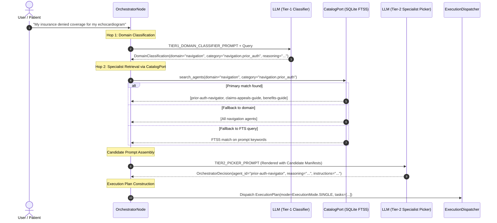

# Two-Hop Routing Deep Dive

When routing queries across a catalog of 20+ specialized healthcare agents, standard single-hop prompt classification suffers from severe weaknesses: prompt context dilution, hallucination of non-existent agents, inability to perform full-text search against deep agent capabilities, and poor scalability as the catalog expands.

Carefold solves this problem through **Two-Hop Hierarchical Routing**, combining structured LLM domain classification with SQLite FTS5 database retrieval and structured specialist selection.

---

## Why Two-Hop Routing?

| Dimension | Flat Single-Hop Routing | Carefold Two-Hop Routing |
|---|---|---|
| **Context Size** | Injects all 20+ agent manifests into prompt on every turn (~6,000+ tokens). | Injects only domain taxonomy (~300 tokens) in Hop 1; injects top 3–5 candidates (~800 tokens) in Hop 2. |
| **Search Accuracy** | Relies entirely on LLM memory of manifest text; prone to attention drift. | Leverages SQLite FTS5 BM25 full-text indexing over titles, descriptions, and personas. |
| **Catalog Scalability**| Degrades rapidly beyond 20 agents due to context limits. | Scales smoothly to hundreds of agents across clinical subspecialties. |
| **Determinism** | High variance in agent selection on ambiguous queries. | 4-step deterministic fallback chain guarantees valid specialist resolution. |

---

## Two-Hop Routing Architecture



---

## Hop 1: Tier-1 Domain Classification

In the first hop, the orchestrator invokes the model with `TIER1_DOMAIN_CLASSIFIER_PROMPT` using Pydantic structured output (`carefold/workflows/nodes/orchestrator_node.py`):

```python
class DomainClassification(BaseModel):
    """Structured classification output for Tier-1 domain routing."""

    domain: str = Field(
        ...,
        description="One of 'clinical', 'therapy', 'wellness', 'navigation', 'education'.",
    )
    category: str = Field(
        default="",
        description="Dot-notated subcategory path (e.g. 'navigation.insurance', 'wellness.habits').",
    )
    reasoning: str = Field(
        default="",
        description="Brief classification rationale.",
    )
```

### Canonical Domains:
- **`clinical`**: Organ-specific diseases, symptom preparation, diagnostic test navigation, specialist consultation readiness.
- **`navigation`**: Insurance coverage, prior authorizations, claims appeals, formulary alternatives, medical records coordination.
- **`wellness`**: Habit formation, daily wellness tracking, lifestyle adjustments.
- **`therapy`**: Mental health navigation, counseling preparation.
- **`education`**: General health literacy, anatomical concepts, terminology explanations.

---

## Hop 2: Tier-2 Specialist Picking via CatalogPort

Once the domain and category are classified, `OrchestratorNode` retrieves the top candidate agents using `CatalogPort.search_agents`.

### 4-Step Retrieval Fallback Chain

To guarantee resilient routing even with novel user terminology, `OrchestratorNode._execute_two_hop` executes a 4-step fallback hierarchy:

1. **Step 1: Domain + Category Exact Match**:
   Queries `CatalogPort.search_agents(domain=classified_domain, category=classified_category)`.
2. **Step 2: Domain-Only Match**:
   If Step 1 yields 0 candidates, queries `CatalogPort.search_agents(domain=classified_domain)`.
3. **Step 3: FTS5 Full-Text Match**:
   If Step 2 yields 0 candidates, executes full-text search against the SQLite FTS5 index (`agents_fts`) matching prompt keywords against agent titles, descriptions, and personas.
4. **Step 4: Deterministic Pattern Fallback**:
   If no candidates match, selects the default general triage agent (`visit-steward` or `triage-auditor`).

### Decision Output & Plan Construction

The filtered candidate agents are rendered into a Handlebars prompt, and the model selects the primary specialist using the structured `OrchestratorDecision` schema (`carefold/workflows/nodes/orchestrator_node.py`):

```python
class OrchestratorDecision(BaseModel):
    """Structured output schema for the dynamic orchestrator routing decision."""

    agent_id: str = Field(
        ...,
        description="ID of the chosen specialist agent to delegate to (e.g., 'prior-auth-navigator').",
    )
    reasoning: str = Field(
        ...,
        description="Clear, concise rationale explaining why this specialist was selected to address the user request.",
    )
    instructions: str = Field(
        default="",
        description="Specific instructions, extracted parameters, or focus areas for the delegated specialist agent.",
    )
    missing_skill: Optional[str] = Field(
        default=None,
        description="ID or name of any missing skill that should be generated for this request, or null if all required skills are present.",
    )
    missing_skill_description: Optional[str] = Field(
        default=None,
        description="Specific domain description, guidelines, and reference materials needed for the missing skill to be generated.",
    )
    required_docs: List[str] = Field(
        default_factory=list,
        description="Specific reference doc filenames needed by the specialist to address the user request.",
    )
```

For complex or multi-agent inquiries, the orchestrator constructs an `ExecutionPlan` (`carefold.schemas.plan`) coordinating execution mode (`single`, `parallel`, or `pipeline`) and discrete task assignments:

```python
class ExecutionMode(str, Enum):
    """Execution topology mode for multi-agent dispatch."""

    SINGLE = "single"
    PARALLEL = "parallel"
    PIPELINE = "pipeline"


class AgentTask(BaseModel):
    """Discrete specialist agent task assignment."""

    agent_id: str = Field(
        ...,
        description="Target specialist agent ID responsible for executing this task.",
    )
    instructions: str = Field(
        default="",
        description="Focused clinical or navigation instructions for the agent.",
    )
    task_description: str = Field(
        default="",
        description="Human-readable description of the delegated task.",
    )
    priority: int = Field(
        default=1,
        description="Execution priority level (1 = highest).",
    )
    depends_on: List[str] = Field(
        default_factory=list,
        description="List of agent IDs or task IDs that must complete before this task.",
    )
    required_docs: List[str] = Field(
        default_factory=list,
        description="Specific reference doc filenames required for task execution.",
    )


class ExecutionPlan(BaseModel):
    """Typed execution plan produced by Orchestrator for multi-agent coordination."""

    mode: ExecutionMode = Field(
        default=ExecutionMode.SINGLE,
        description="Topological execution mode: single, parallel, or pipeline.",
    )
    target_agents: List[str] = Field(
        default_factory=list,
        description="List of target specialist agent IDs in execution order.",
    )
    tasks: List[AgentTask] = Field(
        default_factory=list,
        description="Ordered list of discrete agent tasks to execute.",
    )
    reasoning: str = Field(
        default="",
        description="Rationale explaining topology selection and agent delegation.",
    )
```

This two-hop architecture ensures sub-second routing, high precision, and resilient fallback across all healthcare queries.
