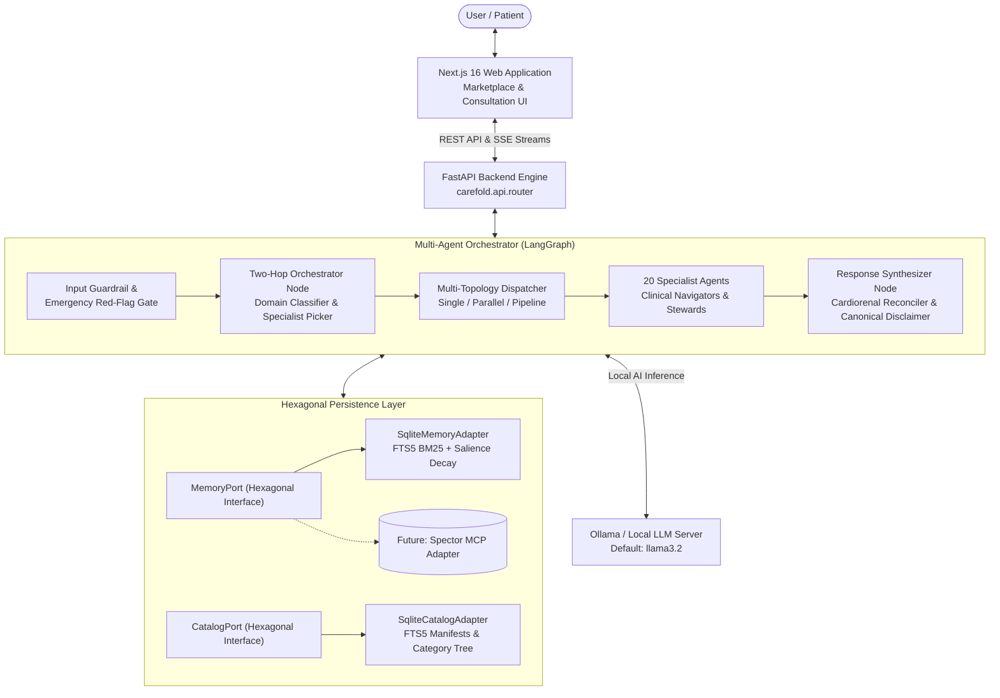

# Carefold Documentation

Welcome to the documentation for **Carefold**, an open-source healthcare AI agent marketplace and local-first runtime developed by **Spectrayan**.

Carefold delivers empathetic, organ-specific clinical navigation and healthcare administrative stewardship while enforcing strict, auditable non-clinical safety boundaries. It is designed from the ground up for patient privacy, local-first execution, and modular extensibility.

---

## High-Level System Architecture

Carefold employs a decoupled, multi-tiered architecture that separates the web user experience from the LangGraph multi-agent execution engine and hexagonal persistence layers.

---

## Core Pillars

Carefold is built on five core design principles:

### 1. Local-First Privacy & Patient Control
Health data should remain under patient custody. Carefold operates entirely on-device by default, utilizing [Ollama](https://ollama.ai) for local inference and SQLite FTS5 for local persistence. No conversation text, attachments, or clinical dossiers leave the user's workstation unless an external provider is explicitly configured.

### 2. Pure Persona Purity
To maintain clinical rigor and prevent architectural rot, specialist agent personas are completely decoupled from filesystem paths and tool-calling plumbing. Specialists focus exclusively on empathetic communication, interview methodology, and clinical triage protocols. The central **Orchestrator** dynamically provisions relevant guidelines, checklists, and reference forms into the agent's prompt context.

### 3. Hexagonal Cognitive Memory
Carefold models human memory using four distinct cognitive tiers:
- **`WORKING`**: Ephemeral turn scratchpad and active execution state.
- **`EPISODIC`**: Timestamped chronological interaction history.
- **`SEMANTIC`**: Consolidated patient profile, preferences, and clinical concepts.
- **`PROCEDURAL`**: Clinical guidelines, checklists, and standard operating procedures.

All memory operations and agent/skill discovery are mediated through abstract interfaces (`MemoryPort` and `CatalogPort`), so storage backends can be swapped without changing workflow nodes. Local SQLite FTS5 is the implemented backend today; a Spector MCP adapter is planned for Q1–Q2 2027 (see the project roadmap).

### 4. Deterministic Clinical Safety & Gating
Carefold enforces multi-layered safety gates prior to agent dispatch:
- **Emergency Red-Flag Detection**: Pre-emptively catches acute life-threatening presentations (crushing chest pain, stroke FAST signs, anaphylaxis) and immediately refers to 911 / emergency departments.
- **Strict Non-Clinical Boundaries**: Refuses requests to provide medical diagnosis, calculate pharmaceutical dosages, alter prescription regimens, or divert emergency care.
- **Canonical Disclaimers & Audit Logging**: Automatically appends canonical legal disclaimers and records zero-body audit events with full redaction of protected health information.

### 5. Specialized Multi-Agent Ecosystem
The marketplace provides **20 specialist agents** spanning 13 organ-specific navigators (cardiology, nephrology, oncology, neurology, etc.) and 7 administrative stewards and companions (prior authorization, claims appeals, formulary guidance, etc.), backed by **22 standardized skill packs**. Six internal system agents (orchestrator, document extractor, and others) and `_template` starters for new agents and skills are also included.

---

## Documentation Roadmap

| Section | Description |
|---|---|
| [**Getting Started**](getting-started/installation.md) | Installation instructions, environment configuration, Ollama setup, and quickstart guide. |
| [**Architecture**](architecture/overview.md) | System overview, the 5-phase orchestrator lifecycle, execution topologies, and two-hop routing. |
| [**Specialist Agents**](agents/catalog.md) | Catalog of all 20 specialist agents, manifest specifications, and persona contracts. |
| [**Skills**](skills/authoring.md) | Guide to authoring skills, 3-line intended-use statements, and reference document integration. |
| [**Cognitive Memory**](memory/spector.md) | Hexagonal architecture, the 4 cognitive memory tiers, and SQLite FTS5 adapter internals. |
| [**Safety & Guardrails**](safety/boundaries.md) | Clinical risk classes, refusal rules, emergency red flags, and audit logging. |
| [**API Reference**](api/reference.md) | Complete REST API endpoints and Server-Sent Events (SSE) streaming protocol. |
| [**Architecture Decision Records**](adr/README.md) | Spector-style Living ADR framework capturing formal architectural choices. |
